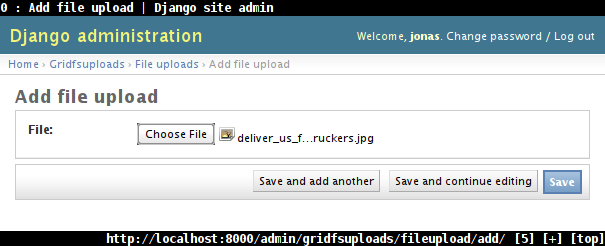
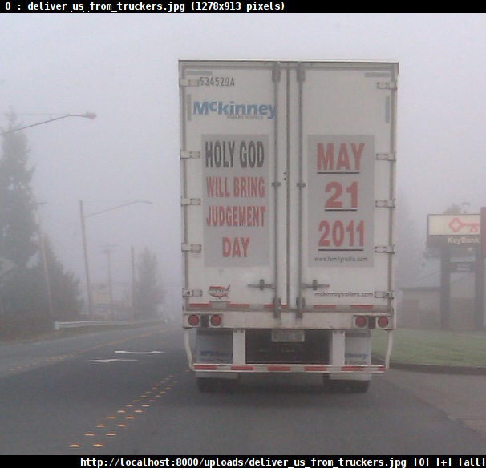

Tutorial
========

The goal of this step-by-step tutorial is to introduce you to non-relational
schema design and the tools Django MongoDB Engine provides to put that design
into action.

This tutorial assumes that you are already familiar with Django_ and have a
basic idea of MongoDB operation and a :doc:`configured MongoDB installation <topics/setup>`.

Our example project covers the development of a simple single-user blog
application with tag and comment capabilities.

.. note::
   When you try out the shell examples given in this tutorial (which you should!)
   it is important to remember that model changes will have no effect until you
   restart the shell.

Non-Relational Schema Design
----------------------------
If you come from a relational background a non-relational database may seem
counter-intuitive or completely odd since most non-relational databases are
document and multi-key oriented and provide a different method of querying
and excluding data.

Perhaps a good way to get used to non-relational style data modeling is to ask
yourself "What would I never do in SQL".

Because most relational databases lack proper list data structures you may
typically model the Posts ⇔ Tags ⇔ Comments relationship using three
models/tables, one table per entity type.

Organizing your data using multiple relationships is the exact opposite of what
we will do for our non-relational data model: Have one single collection (table)
for everything and store tags and comments in simple lists.

Here is a simple model for blog posts, designed for non-relational databases:

.. literalinclude:: code/tutorial/v1/nonrelblog/models.py

Let's try this out. Fire up a Django shell and add a post:

.. literalinclude:: code/tutorial/v1/nonrelblog/tests.py
   :start-after: v1
   :end-before: """

In the `MongoDB shell`_, you can see how the resulting data record looks like::

   {
     "_id" : ObjectId("..."),
     "tags" : ["mongodb", "django"],
     "text" : "Just wanted to drop a note from Django. Cya!",
     "title" : "Hello MongoDB!",
     "comments" : [
       "Great post!",
       "Please, do more of these!"
     ]
   }

You may have noticed something's missing from the ``Post`` class:
We have no information about the date and time our posts are created!
Fixed easily.

Migration-Free Model Changes
----------------------------
Happily, because MongoDB is schema-less, we can add new fields to our model
without corrupting existing data records ("documents").  Forget about migrations!

So, adding a new field boils down to... adding a new field. ::

   class Post(models.Model):
       created_on = models.DateTimeField(auto_now_add=True, null=True) # <---
       title = models.CharField(max_length=255)
       text = models.TextField()
       tags = ListField()
       comments = ListField()

One thing to keep in mind is what happens to our old posts: Because they miss
a ``created_on`` value, when fetching them in Django, the ``created_on``
attribute will be set to the :class:`~django.db.models.DateTimeField` default
value, `None`. To allow `None` as value, we have to pass ``null=True``.

.. code-block:: pycon

   We can use database records even though they were created
   with an older version of or model schema:

   >>> from nonrelblog.models import Post
   >>> old_post = Post.objects.all()[0]
   >>> old_post.created_on is None
   True
   >>> new_post = Post.objects.create()
   >>> new_post.created_on is None
   False

There's another flaw in our design: We can't store any comment meta information
like author name/email and creation time.  We'll tackle that in the next section.

.. _tutorial/embedded-models:

Embedded Models
---------------
So far, we used to store comments as a list of strings. We'll have to rework
that design in order to store additional information for each comment.

Let's first design our model for comments. ::

   class Comment(models.Model):
       created_on = models.DateTimeField(auto_now_add=True)
       author_name = models.CharField(max_length=255)
       author_email = models.EmailField()
       text = models.TextField()

The BSON representation of this model looks like this::

   {
     'created_on': ISODate('...'),
     'author_name': 'Bob',
     'author_email': 'bob@example.org',
     'text': 'The cake is a lie'
   }

MongoDB allows to have objects within objects -- called "subobjects" or
"embedded objects" -- so we could also represent this as follows::

   {
     'created_on': ISODate('...'),
     'author' : {
       'name': 'Bob',
       'email': 'bob@example.org'
     },
     'text' : 'The cake is a lie'
   }

Django itself does not allow such nesting -- because there's no such thing in
SQL -- but Django MongoDB Engine provides the tools to do anyway.

To embed instances of models into other models, we can use
:doc:`EmbeddedModelField <topics/embedded-models>`:

.. literalinclude:: code/tutorial/v2/nonrelblog/models.py
   :lines: 10-21
   :prepend: from djangotoolbox.fields import EmbeddedModelField

Let's hop into the Django shell and test this:

.. literalinclude:: code/tutorial/v2/nonrelblog/tests.py
   :start-after: from
   :end-before: Post(

In the same way, we can embed ``Comment`` objects into the ``comments`` list
of a blog post, by
:ref:`combining ListField and EmbeddedModelField <topics/list-of-subobjects>`:

.. literalinclude:: code/tutorial/v2/nonrelblog/models.py
   :pyobject: Post

We should mess around with our new ``Post`` model at this point.

.. literalinclude:: code/tutorial/v2/nonrelblog/tests.py
   :start-after: Author:
   :end-before: """

Here's how this post is represented in MongoDB::

    {
      "_id" : ObjectId("..."),
      "tags" : [ ],
      "text" : "",
      "title" : "I like cake",
      "comments" : [
        {
          "text" : "The cake is a lie",
          "created_on" : ISODate("..."),
          "id" : null,
          "author" : {
            "email" : "bob@example.org",
            "name" : "Bob",
            "id" : null
          }
        }
      ],
      "created_on" : ISODate("...")
    }

Neat, isn't it?

Using lists, dictionaries and embedded objects, you can design your database
schema very similar to the structure of the Python objects used all over your
code.  No need to squeeze your objects into primitive non-relational schemas.

Adding Some Templates
---------------------
To make our app actually useful, it's time to add some views.  Here's how your
post overview page could look like:

.. literalinclude:: code/tutorial/v3/nonrelblog/templates/nonrelblog/post_list.html
   :language: html+django

Pretty straightforward. Here's the single post template:

.. literalinclude:: code/tutorial/v3/nonrelblog/templates/nonrelblog/post_detail.html
   :language: html+django

By using Django's `Generic Views`_, we even don't have to write any views, so
all that's left is mapping URLs to those templates:

.. literalinclude:: code/tutorial/v3/nonrelblog/urls.py

A fully working example project can be found in :file:`docs/source/code/tutorial/v3/`.

Uploading Files to GridFS
-------------------------
To make our blog less boring, we should add some nice pictures.

As MongoDB disciples, what comes to mind when thinking about storing files?
Of course! GridFS!

Django MongoDB Engine provides a :doc:`Django storage backend for GridFS <topics/gridfs>`
that allows you to use GridFS like any other file storage:

.. literalinclude:: code/tutorial/v4/gridfsuploads/__init__.py

.. literalinclude:: code/tutorial/v4/gridfsuploads/models.py

We can now use the Django admin to upload files to GridFS.

Next step is to write a serve view:

.. literalinclude:: code/tutorial/v4/gridfsuploads/views.py

.. warning::

   Serving files through such a view is *inefficient* and *insecure*.
   **Never** use this in production! There are much superior tools for serving
   files out of GridFS, e.g. `nginx-gridfs <https://github.com/mdirolf/nginx-gridfs>`_.

We can now upload files via the admin...

... and retrieve them under ``/uploads/``:

As always, the full project source can be found in :file:`docs/source/code/tutorial/v4/`.

.. _tutorial/mapreduce:

Using Map/Reduce
----------------
Our last quest is to count the number of comments each author has made.

This could be done in plain Django but would be very inefficient because we
would have to literally fetch all posts (with all comments) from the database.

Instead, we're going to use :doc:`Map/Reduce <topics/mapreduce>` to accomplish the task.

Programmer's introduction to Map/Reduce: The *map* function gets called for each
document and emits one or more *key-value pairs*. The *reduce* function is passed
a *key* and a list of *values* and reduces them to a single resulting value.
The result of such a Map/Reduce operation is a list of key-value pairs,
the keys being those emitted by the map function and the values those resulting
from the reduce function.

Our map function emits a ``(author, 1)`` pair for each comment.

.. literalinclude:: code/tutorial/v7/nonrelblog/tests.py
   :language: js
   :start-after: mapfunc
   :end-before: """

The reduce function sums up all the ones emitted by the map function.

.. literalinclude:: code/tutorial/v7/nonrelblog/tests.py
   :language: js
   :start-after: reducefunc
   :end-before: """

Map/Reduce support is added to Django's ORM using a custom
:class:`~django.db.models.Manager` which is installed to the ``Post`` model
as follows::

   from django_mongodb_engine.contrib import MongoDBManager
   ...
   class Post(models.Model):
      ...
      objects = MongoDBManager()

Ready to Map/Reduce?

.. literalinclude:: code/tutorial/v7/nonrelblog/tests.py
   :start-after: mapreduce
   :end-before: """

This is worth a review.

* :meth:`MongoDBManager.map_reduce` returns an iterator yielding
  :class:`MapReduceResult` objects.
* The third argument to :meth:`~MongoDBManager.map_reduce` is the name of the
  collection where the Map/Reduce results should go to.
* The fourth argument, `delete_collection`, tells Django MongoDB Engine to
  delete the temporary collection passed as third argument after the Map/Reduce
  result iterator is exhausted.
* The resulting counts are floats because Javascript does not distinguish
  between integers and floating point numbers.

Lastly, a quick word of warning. Map/Reduce is designed to be used for
*one-time operations* -- although it performs very well, it's definitely not
something you would want to execute on a per-request basis.
*Don't use Map/Reduce in "hot" parts of your code*.

Where to go from here
---------------------
This tutorial should've given you an idea about how easy it is to combine Django
and MongoDB using Django MongoDB Engine to produce simple, scalable applications.

Hopefully you've learned something useful for your next Django project that you
should begin hacking on *now*. Go build something cool,
and :ref:`let us know about it <contributing/mailinglist>`!

You can always come back to this documentation as you need to learn new tricks:

.. include:: doc-organization.rst
   :start-line: 2

If you need support, don't hesitate to write to our
:ref:`mailing list <contributing/mailinglist>`.

Also, we'd love to see you
:doc:`getting involved in Django MongoDB Engine's development <meta/contributing>`!

* Fix the documentation. None of the Django MongoDB Engine developers are
  native English speakers, so this docs are probably full of typos and weird,
  ungrammatical or incomprehensible phrasings.  Every typo is worth reporting!
* Extend and improve the documentation. We appreciate any contribution!
* Blog/write about Django MongoDB Engine, and
  :ref:`send us a link <contributing/mailinglist>` to your work.
* :ref:`Report bugs and feature requests <contributing/bugreports>`.
* Finally, :ref:`send pull requests or patches <contributing/patches>` containing
  bug fixes, new features and code improvements.

.. _Django: http://djangoproject.com
.. _MongoDB shell: http://www.mongodb.org/display/DOCS/mongo+-+The+Interactive+Shell
.. _Generic Views: http://docs.djangoproject.com/en/dev/topics/class-based-views/
